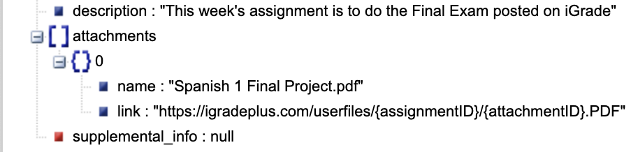

Attachment Handling
===================

.. seealso::
   You will have need to read :doc:`What are IDs? <ids>` in order to fully
   handling and downloading attachments.

Getting Attachments
~~~~~~~~~~~~~~~~~~~

The ``get_attachments()`` function requires you to have the assignment ID
of the assignment you want to get attachment details from. You can get
it manually by **looking at the URL** when you are at the attachment of
your choice, or you can obtain it from :doc:`Assignments <getting_assignments>`.
Usage:

::

   client.get_attachments(assignmentID)

.. note::
   This will not only return assignment attachments, but also the
   description and supplemental info of the requested assignment.

Using this function will return the following:

   https://json.stack.hu

Downloading Attachments
~~~~~~~~~~~~~~~~~~~~~~~

As well as obtaining attachments from an assignment, you can also
download them using this code:

.. code:: python

   client.download_attachments(assignmentID, 'data'). # includes optional folder location

This function is a lot more interesting. You first have to specify the
assignment ID, as well as a folder location. The return data is a
``list`` **of file locations** where you can find the downloaded
attachments.

.. note::
   The folder location is optional. The default
   location is ``data``, which is an internal directory that is reset every
   time the client is run.