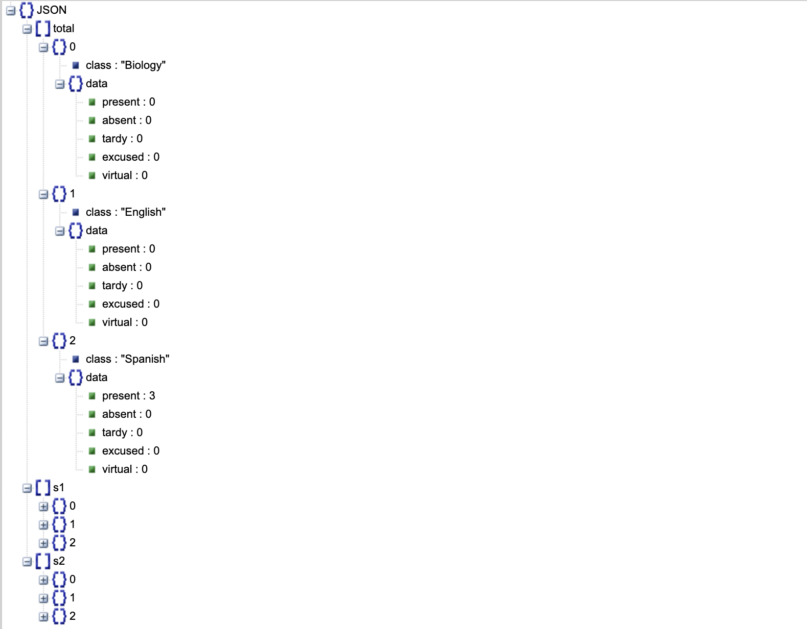

Attendance Info
===============

One neat feature is getting your attendance for the year. You get this
data by using this function:

.. code:: python

   client.get_attendance()

.. note::

   As of now, only the class name is provided. The class ID will soon
   be provided in the response as well in order for you to
   differentiate between classes within your code.

This will get the attendance for each class and each semester. Since
different teachers have different methods of counting attendance, the
response data may seem confusing. You can see the data here:

   https://json.stack.hu

Here you can see the layout is as follows:

-  Total

   -  Class 1

      -  Class name
      -  Data

         -  Present
         -  Absent
         -  Tardy
         -  Excused
         -  Virtual

   -  Class 2

      -  …

-  s1

   -  …

.. note::

   This feature’s format and data organization may be changed in
   the future to make the response data less confusing to handle and use
   within the code.