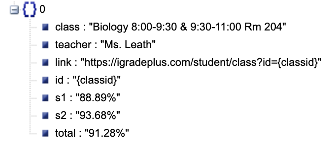

Getting Grades
==============

Current Grades
~~~~~~~~~~~~~~

Use this code to get current grades:

.. code:: python

   client.get_current_grades()

This will return a ``list`` containing ``dicts``, like what is shown below:

   https://json.stack.hu

Past Grades
~~~~~~~~~~~

This is the same as above, but uses this code:

.. code:: python

   client.get_past_grades()

The only difference is that this will return “years”, which contains the
years the class was taken. For example, it may be “2021-2022”.

Example Code
~~~~~~~~~~~~

.. code:: python

   from igrade import Client

   username = ''
   password = ''

   client = Client()
   client.login_with_credentials(username, password)
   classes = client.get_current_grades

   print(f'You are enrolled in {len(classes)} classes.'

   for current_class in classes:
   	print(f'Class: {current_class["class"]}'). # name of class
   	print(f'You have a final grade of {current_class["total"]}.\n')

   client.close()