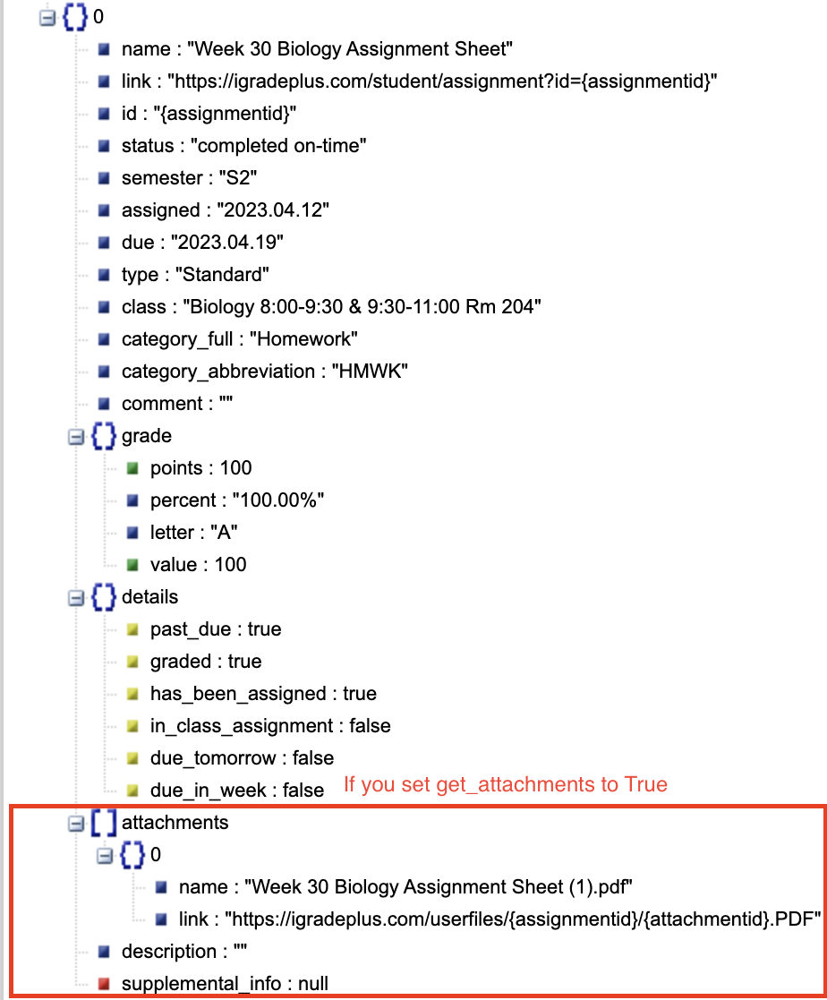

Getting Assignments
===================

.. _assignments:

Overview
~~~~~~~~

There are four ways you can get assignments: getting **all**,
**upcoming**, **recent**, or **problematic** assignments - just like in
your normal iGrade account page. This is the most feature-packed element
included in the module, so there is a lot to cover. We’ll start off with
the basics, just getting our upcoming assignments. Other assignment
types are covered below.

Upcoming Assignments
~~~~~~~~~~~~~~~~~~~~

.. note::
   Upcoming assignments are a little bit different than the others because of
   the way the data is returned. This is mainly because upcoming assignments
   do not include the grades and some other info.

These are the assignments that show up in the "upcoming" tab
in your iGradePlus account under assignments. This is usually 10-20 assignments long.

.. seealso::

   You are also now able to filter through assignments to only get assignments
   relevant to what you need. See :doc:`filters` for more information and how
   to use them.

.. code:: python

   client.get_upcoming_assignments()

This will return a dictionary, of which you can see the visualization
below:

-  Name
-  Link
-  :doc:`ID <ids>`
-  Status  (excludes upcoming assignments)
-  Semester
-  Assigned date
-  Due date
-  Type
-  Class
-  Full category
-  Abbreviated category
-  Teacher comments
-  All grade info  (excludes upcoming assignments)
-  Extra details/info

You can also set get_attachments to ``True`` by typing
``client.get_upcoming_assignments(get_attachments=True)``, which will
return the following:

-  All attachment names and links
-  Description
-  Supplemental info

While this does get much more info, it does take an extra 2-3 seconds.
You can see the visualization below:

   https://jsonviewer.stack.hu/

If you want to see this visualization yourself, use this code:

.. code:: python

   from igrade import Client
   import json

   username = ''
   password = ''

   client = Client()
   client.login_with_credentials(username, password)

   data = client.get_upcoming_assignments(get_attachments=True)
   print(json.dumps(data))  # copy and paste output into https://jsonviewer.stack.hu

   client.close()

.. note::
   The "get assignment" methods return a ``list`` containing ``dicts``, or dictionaries.
   Use json.dumps() to convert the return data into a JSON string. There is little to
   no difference between JSON and Python dictionaries, but you will need to convert it
   before inputting it into a JSON visualizer like what is shown above.

Other Assignments Types
~~~~~~~~~~~~~~~~~~~~~~~

   ``get_upcoming_assignments()``

   This is the main assignment type. This is usually a list of 10-20
   assignments, depending on the type of schooling you have. It reaches
   about 1-3 weeks into the future.

..

   ``get_all_assignments()``

   This gets all assignments, past and future, so while the list varies,
   it is always very long. This is the second most used assignments
   type.

   ``get_recent_assignments()``

   This gets assignments that have been due in the past week or two.
   This is usually just shorter than upcoming assignments.

..

   ``get_problematic_assignments()``

   This type of assignment are things that have a very low grade on, or
   are way past due. Hopefully, this is a low number. If not, you should
   probably spend more time on that than reading this documentation ;)

Filters
~~~~~~~

There is now an option to use filters with the 4 functions for getting
assignments. You can filter by name, grade, date and much more. For
more information, see :doc:`this page <filters>`.

Example Code
~~~~~~~~~~~~

This section gives you an example program to get a head start using the
module.

.. code:: python

   from igrade import Client

   username = ''
   password = ''

   client = Client()
   assignments = client.get_upcoming_attachments()

   print(f'You have {len(assignments)} assignments due!}')

   for assignment in assignments:
      print(f'{assignment["name"]} is due on {assignment["due"]}.')
      print(f'This assignments is worth {assignment["grade"]["value"]} points.\n')

   client.close()