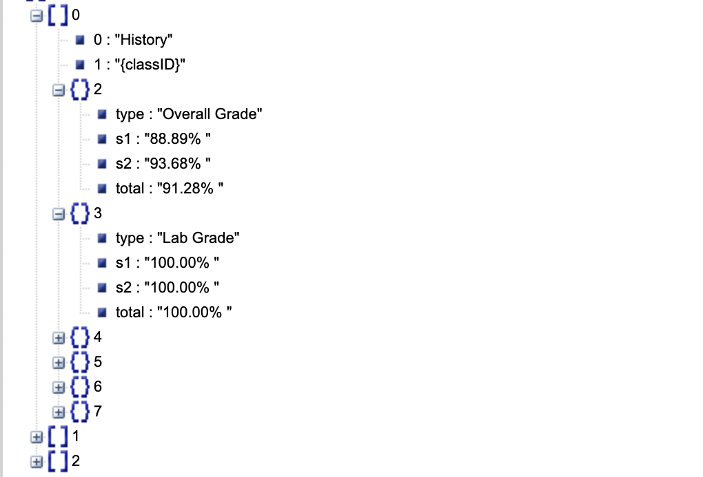

Class Performance Info
======================

One useful feature included in this module that helps you get
comprehensive grade info is the ability to get class performance info.
This is data that can be obtained through going to a class page in
iGrade and going to the “*performance*” section.

.. code:: python

   client.get_class_performance()

The response data, like :doc:`attendance <attendance>`, is **dependent on the class in
question** as far as how organized and what is included in the performance
section. The visualization list is here:

-  Index 0

   -  Class name
   -  Class ID
   -  Performance section 0

      -  Type (performance name)
      -  S1
      -  S2
      -  Total

   -  Performance section 1
   -  …

-  Index 1

   -  …

Here is an image, showing the parsed JSON:

   https://json.stack.hu

.. note::

   This feature’s format and data organization may be changed in
   the future to make the response data less confusing to handle and use
   within the code.